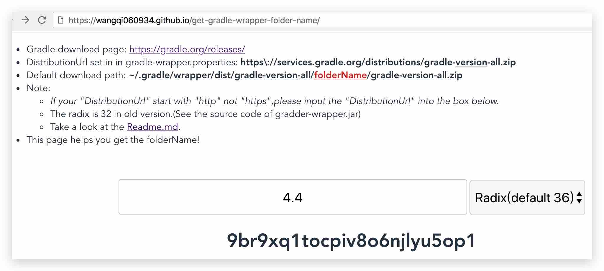
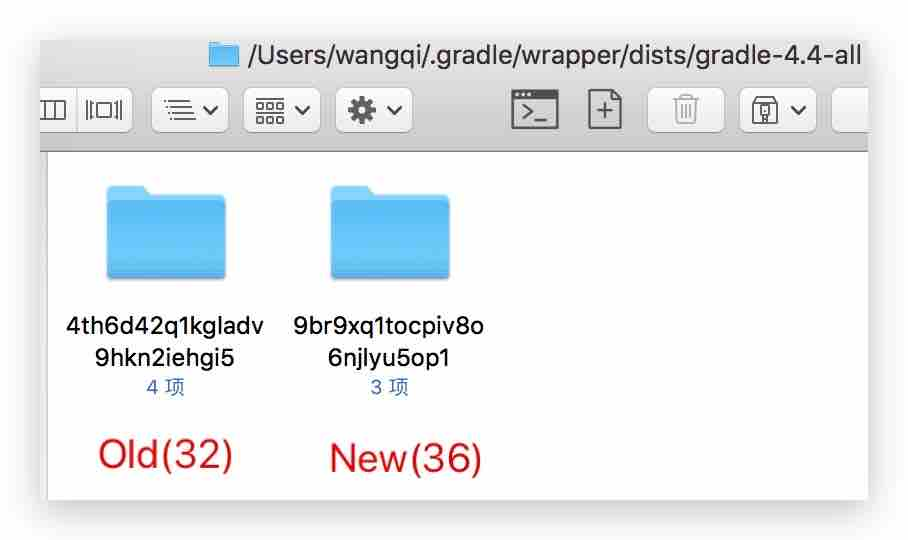
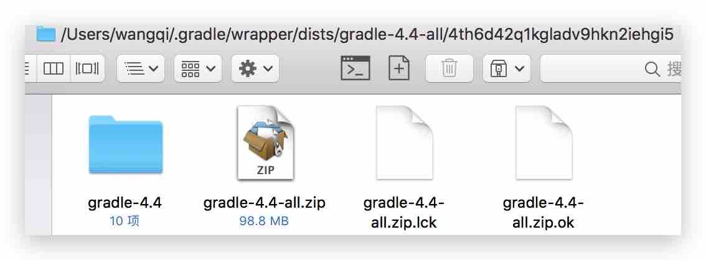
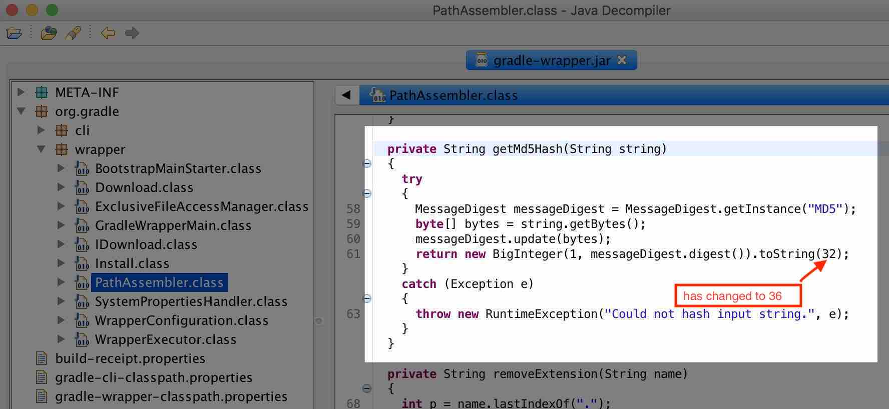

# get-gradle-wrapper-folder-name

> Get the download path of gradle-version-all.zip

## How to use
[Online](https://wangqi060934.github.io/get-gradle-wrapper-folder-name/)






## Reference
> org.gradle.wrapper.PathAssembler#getMd5Hash



**Note:the radix has been changed from 32 to 36.**

## Build Setup
``` bash
# install dependencies
npm install

# serve with hot reload at localhost:8080
npm run dev

# build for production with minification
npm run build

# build for production and view the bundle analyzer report
npm run build --report
```

## Lisense
[See](https://github.com/wangqi060934/get-gradle-wrapper-folder-name/blob/master/LICENSE)